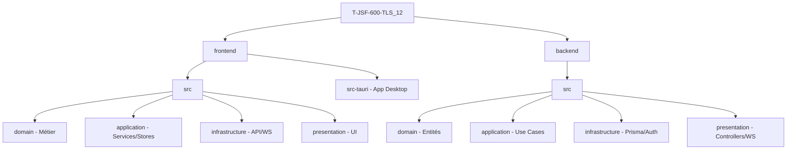

#  Projet T-JSF-600-TLS_12 — Neosis

Bienvenue dans la documentation officielle du projet **T-JSF-600-TLS_12** dit **Neosis**. Plateforme de messagerie communautaire temps réel, inspirée de Discord, développée en Clean Architecture.

---

##  1. Index de la Documentation

### 1.1 Commencer ici
*   **Identifiant** : `PROJECT_ARCHITECTURE_COMPLETE.md`
*   **Contenu** : Vue d'ensemble, Architecture Frontend/Backend, Règles de dépendances, Bonnes pratiques.

### 1.2 Documentation Frontend
*   [`frontend/README_ARCHITECTURE.md`](frontend/README_ARCHITECTURE.md) : Détails techniques, couches et structure.
*   [`frontend/PATTERNS.md`](frontend/PATTERNS.md) : Patterns de conception, standards de code.
*   [`frontend/QUICK_START.md`](frontend/QUICK_START.md) : Installation et lancement rapide.

### 1.3 Documentation Backend
*   [`backend/BACKEND_REORGANIZATION.md`](backend/BACKEND_REORGANIZATION.md) : Guide de la nouvelle structure.
*   [`backend/REORGANIZATION_SUMMARY.md`](backend/REORGANIZATION_SUMMARY.md) : Historique des changements et statistiques.
*   [`backend/README_ARCHITECTURE.md`](backend/README_ARCHITECTURE.md) : Cœur de l'architecture backend.
*   [`backend/PATTERNS.md`](backend/PATTERNS.md) : Cas d'usage et structuration des services.
*   [`backend/QUICK_START.md`](backend/QUICK_START.md) : Déploiement et workflow local.

---

##  2. Architecture du Projet (Vue Rapide)

### 2.1 Stack Frontend
*   **Framework** : Next.js 14+
*   **App Desktop** : Tauri v2 (Rust)
*   **Bibliothèque UI** : React 18+
*   **Gestion d'état** : Zustand
*   **Typage** : TypeScript strict
*   **Style** : TailwindCSS + Framer Motion
*   **Temps réel** : Socket.IO Client
*   **Internationalisation** : Système de locale custom (FR / EN)

### 2.2 Stack Backend
*   **Environnement** : Node.js
*   **Framework** : Express.js
*   **Base de données** : PostgreSQL via Supabase (Prisma ORM)
*   **Typage** : TypeScript strict
*   **Authentification** : JWT + bcrypt
*   **Temps réel** : Socket.IO Server
*   **Validation** : Zod
*   **Stockage fichiers** : Supabase Storage

---

##  3. Structure Générale du Projet



---

##  4. Fonctionnalités Implémentées

### 4.1  Authentification
- Inscription et connexion utilisateur.
- Gestion sécurisée des tokens JWT.
- Hashage des mots de passe (bcrypt).
- Persistance de session et redirection automatique.

### 4.2  Serveurs (Communautés)
- Création et administration des serveurs.
- Gestion des propriétaires et paramètres globaux.
- Invitation par lien avec code unique.

### 4.3  Channels
- Salons textuels et vocaux par serveur.
- Système de permissions granulaire (Propriétaire / Admin / Membre).

### 4.4  Messages (Channels & DM)
- Envoi, édition et suppression de messages.
- **Réponse à un message** : citation visuelle, lien de navigation vers le message original, notification temps réel à l'auteur du message cité.
- Réactions emoji sur les messages.
- Upload de pièces jointes (images, fichiers).
- Rendu optimiste (affichage immédiat avant confirmation serveur).

### 4.5  Messages Directs (DM)
- Conversations privées entre utilisateurs.
- Système de réponse identique aux channels.
- Indicateur de frappe en temps réel.

### 4.6  Système d'amis
- Envoi, acceptation et refus de demandes d'amis.
- Suppression d'un ami depuis une conversation DM.
- Statut en ligne / hors ligne.

### 4.7  Voix & Vidéo
- Appels vocaux et vidéo en temps réel (WebRTC).
- Partage d'écran.
- Indicateur de parole active.

### 4.8  Notifications
- Notifications bureau natives (Tauri / Web).
- Badge de messages non lus par canal.
- Notification de réponse à un message.
- Notification de mention.

### 4.9  Membres & Modération
- Gestion des rôles (Propriétaire, Admin, Membre).
- Expulsion et bannissement.
- Liste des membres du serveur.

### 4.10  App Desktop (Tauri)
- Application native Windows / macOS / Linux via Tauri v2.
- Icônes branding Neosis sur toutes les plateformes.
- Notifications système natives.

---

##  5. Principes d'Architecture

### 5.1 Clean Architecture
La hiérarchie des couches suit strictement cet ordre descendant :
1. **Présentation** (Interface)
2. **Application** (Cas d'usage)
3. **Domaine** (Cœur métier)
4. **Infrastructure** (Détails techniques)

### 5.2 Principes Clés
- **Indépendance** : Le domaine ne dépend d'aucune couche externe.
- **Typage** : Utilisation intensive de TypeScript pour la sécurité.
- **Modularité** : Organisation logique par fonctionnalité.
- **Temps réel** : Toutes les mutations importantes sont propagées via Socket.IO.

---

##  6. Démarrage Rapide

### 6.1 Prérequis
- Node.js 18+
- PostgreSQL 14+ (ou Supabase)
- Rust + Tauri CLI (pour l'app desktop uniquement)

### 6.2 Frontend (Web)
```bash
cd frontend
npm install
npm run dev          # http://localhost:3000
```

### 6.3 Frontend (Desktop)
```bash
cd frontend
npm install
npm run tauri dev    # Lance l'app Tauri en mode développement
```

### 6.4 Backend
```bash
cd backend
npm install
npx prisma migrate dev
npm run dev          # http://localhost:3001
```

### 6.5 Variables d'environnement
Copier les fichiers `.env.example` à la racine de `frontend/` et `backend/` et renseigner :
- `DATABASE_URL` — URL de connexion PostgreSQL / Supabase
- `JWT_SECRET` — Clé secrète JWT
- `SUPABASE_URL` / `SUPABASE_ANON_KEY` — Accès Supabase Storage
- `NEXT_PUBLIC_API_URL` / `NEXT_PUBLIC_WS_URL` — URLs de l'API et du WebSocket

---

##  7. Statut du Projet

### 7.1 Terminé
- [x] Architecture Clean Front/Back
- [x] Authentification JWT complète
- [x] Serveurs, Channels, Messages CRUD
- [x] Messages Directs (DM)
- [x] Système d'amis
- [x] Voix & Vidéo (WebRTC)
- [x] Réponse à un message (channels + DM + notifications)
- [x] Réactions emoji
- [x] Upload de pièces jointes
- [x] Notifications bureau
- [x] Internationalisation (FR / EN)
- [x] Application desktop Tauri (icônes Neosis)

### 7.2 En cours / À faire
- [ ] Finalisation des tests unitaires et d'intégration
- [ ] Optimisation des performances WebSocket (rooms, namespaces)
- [ ] Channels vocaux persistants (multi-utilisateurs simultanés)
- [ ] Recherche globale (messages, membres, serveurs)

---

##  8. Navigation Technique

| Couche | Responsabilité | Emplacement |
| :--- | :--- | :--- |
| **Domaine** | Règles & Interfaces | `src/domain/` |
| **Application** | Logique applicative | `src/application/` |
| **Infrastructure** | Données & Outils | `src/infrastructure/` |
| **Présentation** | Points d'entrée | `src/presentation/` |

---

##  Liens Rapides
- **Code Frontend** : [`frontend/src/`](frontend/src/)
- **Code Backend** : [`backend/src/`](backend/src/)
- **Schéma DB** : [`backend/prisma/schema.prisma`](backend/prisma/schema.prisma)
- **Config Tauri** : [`frontend/src-tauri/tauri.conf.json`](frontend/src-tauri/tauri.conf.json)

---

> **Dernière mise à jour** : Avril 2026 — Hugo, Bastian et Harel
> **Statut** : Développement Actif
