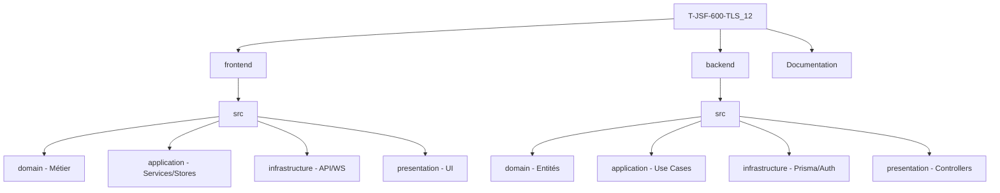

#  Projet T-JSF-600-TLS_12 — Architecture Complète

Bienvenue dans la documentation officielle du projet **T-JSF-600-TLS_12** dit Neosis. Ce document est votre guide principal pour comprendre l'écosystème, l'architecture et les standards du projet.

---

##  1. Index de la Documentation

### 1.1 Commencer ici
*   **Identifiant** : `PROJECT_ARCHITECTURE_COMPLETE.md`
*   **Contenu** : Vue d’ensemble, Architecture Frontend/Backend, Règles de dépendances, Bonnes pratiques.

### 1.2 Documentation Frontend
*   [`frontend/README_ARCHITECTURE.md`](frontend/README_ARCHITECTURE.md) : Détails techniques, couches et structure.
*   [`frontend/PATTERNS.md`](frontend/PATTERNS.md) : Patterns de conception, standards de code.
*   [`frontend/QUICK_START.md`](frontend/QUICK_START.md) : Installation et lancement rapide.

### 1.3 Documentation Backend
*   [`backend/BACKEND_REORGANIZATION.md`](backend/BACKEND_REORGANIZATION.md) : Guide de la nouvelle structure.
*   [`backend/REORGANIZATION_SUMMARY.md`](backend/REORGANIZATION_SUMMARY.md) : Historique des changements et statistiques.
*   [`backend/README_ARCHITECTURE.md`](backend/README_ARCHITECTURE.md) : Coeur de l'architecture backend.
*   [`backend/PATTERNS.md`](backend/PATTERNS.md) : Cas d'usage et structuration des services.
*   [`backend/QUICK_START.md`](backend/QUICK_START.md) : Déploiement et workflow local.

---

##  2. Architecture du Projet (Vue Rapide)

### 2.1 Stack Frontend
*   **Framework** : Next.js 14+
*   **Bibliothèque UI** : React 18+
*   **Gestion d’état** : Zustand
*   **Typage** : TypeScript strict
*   **Style** : TailwindCSS
*   **Temps réel** : Socket.IO Client

### 2.2 Stack Backend
*   **Environnement** : Node.js
*   **Framework** : Express.js
*   **Base de données** : PostgreSQL (Prisma ORM)
*   **Typage** : TypeScript strict
*   **Authentification** : JWT + bcrypt
*   **Temps réel** : Socket.IO Server
*   **Validation** : Zod

---

##  3. Structure Générale du Projet



---

##  4. Fonctionnalités Implémentées

### 4.1  Authentification
- Inscription et Connexion utilisateur.
- Gestion sécurisée des tokens JWT.
- Hashage des mots de passe (bcrypt).

### 4.2  Serveurs (Communautés)
- Création et administration des serveurs.
- Gestion des propriétaires et paramètres globaux.

### 4.3  Channels
- Salons textuels par serveur.
- Système de permissions granulaire.

### 4.4  Messages
- CRUD complet (Envoi, Edition, Suppression).
- Horodatage et citations/références utilisateurs.

### 4.5  Membres
- Gestion des rôles (Propriétaire, Admin, Membre).
- Actions de modération (Expulsion / Bannissement).

---

##  5. Principes d’Architecture

### 5.1 Clean Architecture
La hiérarchie des couches suit strictement cet ordre descendant :
1.  **Présentation** (Interface)
2.  **Application** (Cas d'usage)
3.  **Domaine** (Cœur métier)
4.  **Infrastructure** (Détails techniques)

### 5.2 Principes Clés
- **Indépendance** : Le domaine ne dépend d'aucune couche externe.
- **Typage** : Utilisation intensive de TypeScript pour la sécurité.
- **Modularité** : Organisation logique par fonctionnalité.

---

##  6. Démarrage Rapide

### 6.1 Prérequis
- Node.js 18+
- PostgreSQL 14+
- Gestionnaire npm ou yarn

### 6.2 Frontend
```bash
cd frontend
npm install
npm run dev # http://localhost:3000
```

### 6.3 Backend
```bash
cd backend
npm install
npx prisma migrate dev
npm run dev # http://localhost:3001
```

---

##  7. Statut de Réorganisation

### 7.1 Terminé
- [x] Architecture Clean Front/Back.
- [x] Injection de dépendances (Backend).
- [x] Séparation des domaines métier.

### 7.2 En cours / À faire
- [ ] Finalisation des tests unitaires et intégration.
- [ ] Optimisation des WebSockets.
- [ ] Middleware d'Auth renforcé.

---

##  8. Navigation Technique

| Couche | Responsabilité | Emplacement (ex. Backend) |
| :--- | :--- | :--- |
| **Domaine** | Règles & Interfaces | `src/domain/` |
| **Application** | Logique applicative | `src/application/` |
| **Infrastructure** | Données & Outils | `src/infrastructure/` |
| **Présentation** | Points d'entrée | `src/presentation/` |

---

##  Liens Rapides
- **Code Frontend** : [`frontend/src/`](frontend/src/)
- **Code Backend** : [`backend/src/`](backend/src/)
- **Schéma DB** : [`backend/prisma/schema.prisma`](backend/prisma/schema.prisma)

---
> **Dernière mise à jour** : Février 2026 Par Hugo,Bastian et Harel 
> **Statut** : Développement Actif 
